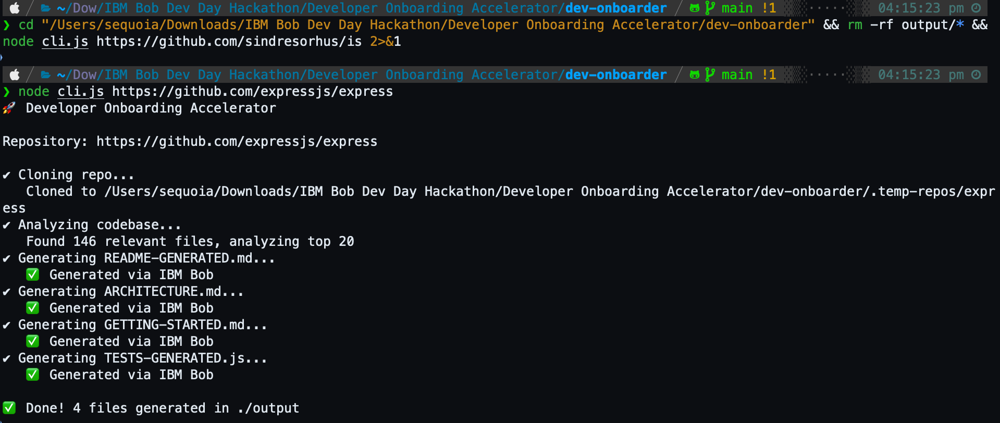

# Developer Onboarding Accelerator

> Turn any GitHub repository into a complete onboarding package in minutes — powered by IBM Bob.

Built for the **IBM Bob Dev Day Hackathon 2026** · Theme: *Turn idea into impact faster*

## 🎬 Demo Video 🎬
> Click the thumbnail below to watch the demo on YouTube

[](https://www.youtube.com/watch?v=9qsrnJGC8fg)

## 📸 Screenshots
> [View all screenshots in bob_sessions/](bob_sessions/)

| IBM Bob Shell | CLI — All 4 files via Bob | Web UI |
|---|---|---|
|  |  |  |

---

## The Problem

Every developer has been there: you join a new project, clone the repo, and stare at thousands of lines of unfamiliar code. Where do you start? What does this thing actually do? Which files matter? How do you run the tests?

**Onboarding a developer to a new codebase takes 4–8 hours on average.** That's time spent:
- Reading through files with no clear entry point
- Reverse-engineering architecture from code
- Hunting for setup instructions scattered across wikis and Slack
- Writing tests from scratch just to understand what functions do

Multiply that by every new hire, every open source contributor, every team member switching projects — and you have a massive, invisible tax on developer productivity.

---

## The Solution

**Developer Onboarding Accelerator** is a CLI + web tool that takes any GitHub repository URL and uses IBM Bob to automatically generate a complete onboarding package in minutes.

One command:
```bash
node cli.js https://github.com/expressjs/express
```

Four files, ready to use:

| File | What it contains |
|------|-----------------|
| `README-GENERATED.md` | Plain English explanation of what the repo does, its purpose, and key features |
| `ARCHITECTURE.md` | How the code is organized, main components, design patterns, and why the structure exists |
| `GETTING-STARTED.md` | Where new developers should start, key files to read first, setup steps, and common workflows |
| `TESTS-GENERATED.js` | Unit tests for the main functions — ready to run, covering typical use cases and edge cases |

> 📂 **[View example output files generated by IBM Bob](output/)**

IBM Bob reads the actual code, understands it, and writes documentation that would take a developer hours to produce manually.

---

## Impact

| Metric | Before | After |
|--------|--------|-------|
| Time to understand a new repo | 4–8 hours | 5–10 minutes |
| Documentation written manually | Hours of work | Zero |
| Barrier to open source contribution | High | Low |
| New hire productivity | Day 3–5 | Day 1 |

**Who benefits:**
- **New hires** — get up to speed on day one instead of day five
- **Open source maintainers** — lower the barrier for contributors
- **Engineering teams** — reduce the onboarding tax across every project switch
- **Solo developers** — return to old projects without re-reading everything

---

## How IBM Bob Is Used

IBM Bob is the **primary AI engine** for this tool. Bob is not a helper or an add-on — it is the core of what makes this work.

For each repository, the tool:

1. Clones the repo and analyzes the top 20 most relevant files
2. Builds a structured codebase snapshot (code + file structure)
3. Calls `bob do "<prompt>"` four times with targeted, role-based prompts:
   - *"You are a technical documentation expert. Given this codebase snapshot, generate a comprehensive README..."*
   - *"You are a software architect. Generate an architecture overview explaining how the code is organized..."*
   - *"You are a developer onboarding specialist. Generate a getting started guide for new developers..."*
   - *"You are a test engineer. Generate unit tests for the main functions..."*
4. Captures Bob's output and writes it directly to files

Bob's ability to understand code context, infer intent, and write in natural language is what makes the output genuinely useful — not just a file listing or a summary, but real documentation a developer can act on.

**Fallback chain:** If Bob times out or is unavailable (e.g., in cloud deployment), the tool automatically falls back to a Groq LLM chain: `llama-3.3-70b-versatile` → `llama-4-scout-17b-16e-instruct` → `llama-3.1-8b-instant` → `allam-2-7b`. This makes the tool resilient and deployable anywhere.

---

## Demo

**CLI:**
```bash
node cli.js https://github.com/expressjs/express
```

```
🚀 Developer Onboarding Accelerator

Repository: https://github.com/expressjs/express

✔ Cloning repo...
   Cloned to .temp-repos/express
✔ Analyzing codebase...
   Found 146 relevant files, analyzing top 20
✔ Generating README-GENERATED.md...   ✅ Generated via IBM Bob
✔ Generating ARCHITECTURE.md...       ✅ Generated via IBM Bob
✔ Generating GETTING-STARTED.md...    ✅ Generated via IBM Bob
✔ Generating TESTS-GENERATED.js...    ✅ Generated via IBM Bob

✅ Done! 4 files generated in ./output
```

**Web UI:**
```bash
node server.js
# Open http://localhost:3000
```

Paste any GitHub URL, click **Run Bob**, and watch the progress stream live. Results appear in 4 tabs with markdown rendering and syntax highlighting.

---

## Setup

### Prerequisites
- Node.js 14+
- IBM Bob CLI installed and authenticated (`bob do "hello"` should work)
- Git

### Install

```bash
git clone https://github.com/RandomProjects-db/Developer-Onboarding-Accelerator.git
cd Developer-Onboarding-Accelerator
npm install
```

### Configure

```bash
cp .env.example .env
```

Edit `.env`:
```
GROQ_API_KEY=your_groq_api_key_here   # Free at https://console.groq.com
```

> IBM Bob is used automatically if you have the Bob CLI installed and authenticated locally. `GROQ_API_KEY` is the fallback.

---

## NPM Package

**repo-onboarder** is published on npm and can be used without cloning this repository.

### Installation & Usage

```bash
# Option 1: Run directly with npx (no installation required)
npx repo-onboarder https://github.com/expressjs/express

# Option 2: Install globally
npm install -g repo-onboarder
repo-onboarder https://github.com/expressjs/express
```

### Configuration

Create a `.env` file in your current directory with your Groq API key:

```bash
# .env
GROQ_API_KEY=your_groq_api_key_here
```

Or set it as an environment variable:

```bash
GROQ_API_KEY=your_key npx repo-onboarder <repo-url>
```

### How It Works

1. **Primary**: Uses IBM Bob CLI if installed locally (`bob do` command)
2. **Fallback**: Uses Groq API with model chain:
   - `llama-3.3-70b-versatile`
   - `meta-llama/llama-4-scout-17b-16e-instruct`
   - `llama-3.1-8b-instant`
   - `allam-2-7b`

Output files are saved to `./output/` in your current directory.

---

## Usage

### CLI
```bash
node cli.js <github-repo-url>
```

Output files are saved to `./output/`.

### Web UI
```bash
node server.js
```

Open `http://localhost:3000`, paste a GitHub URL, click **Run Bob**.

---

## Project Structure

```
dev-onboarder/
├── cli.js          # Entry point — accepts GitHub URL as CLI argument
├── index.js        # Orchestrator — clone → analyze → generate
├── analyzer.js     # Walks directory tree, builds codebase snapshot
├── generator.js    # Calls Bob CLI, captures output, writes 4 files
├── server.js       # Express server — wraps CLI, streams via SSE
├── public/
│   ├── index.html  # Single page web UI
│   ├── style.css   # Dark theme styling
│   └── app.js      # Frontend — SSE client, markdown rendering
└── .env.example    # Environment variable template
```

---

## Running the Generated Tests

The generated `TESTS-GENERATED.js` uses Jest. To run:

```bash
# From the cloned repo directory
npm install --save-dev jest
cp output/TESTS-GENERATED.js tests/
npx jest tests/TESTS-GENERATED.js
```

> **Note:** Generated tests are a starting point. You may need to adjust import paths or add mocks depending on the repo. Think of them as a scaffold, not a final test suite — they give you structure and coverage ideas instantly.
>
> **Troubleshooting:** If tests fail, check that:
> - Import paths match your project structure
> - Required dependencies are installed
> - Mock data matches your actual data structures

---

## Why This Matters

The theme of this hackathon is *"Turn idea into impact faster."* Developer onboarding is one of the biggest hidden costs in software development — and it's completely solvable with AI.

This tool doesn't just demonstrate what IBM Bob can do. It solves a real problem that every developer faces, every time they touch a new codebase. The impact is immediate, measurable, and scales to every GitHub repository that exists.

---

## bob_sessions

See the `bob_sessions/` folder for screenshots and logs of IBM Bob generating documentation during development and testing of this tool.

---

## License

MIT
